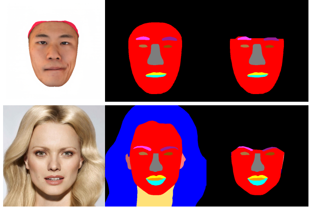

# Face parsing via BiSeNet
  


Use a BiSeNet pretrained model to extract face semantic segmentation masks, correct errors at ears, eyebrows or eyes, and crop face region below eyebrows.

## Demo
1. Get face parsing masks and crop face region using:
	```
	python get_parsing_pairs.py
	```


## References
[face-parsing.Pytorch](https://github.com/zllrunning/face-parsing.PyTorch)
